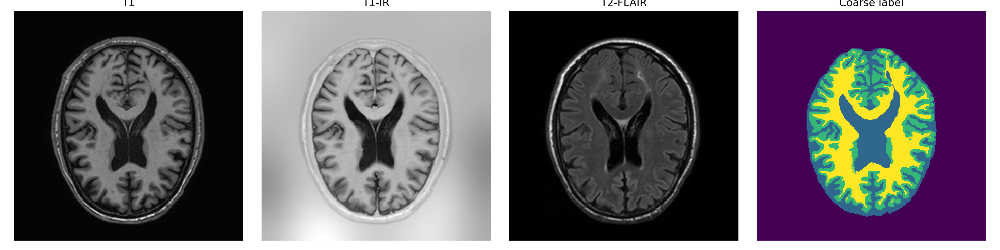
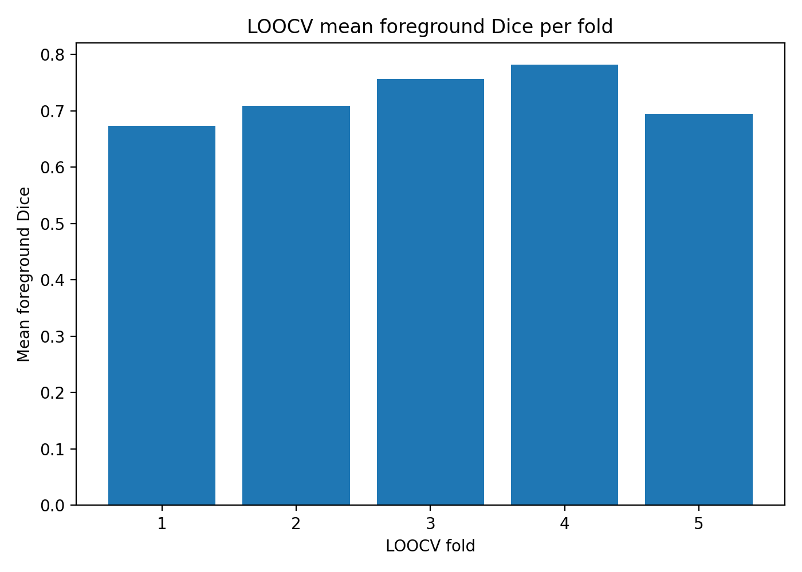
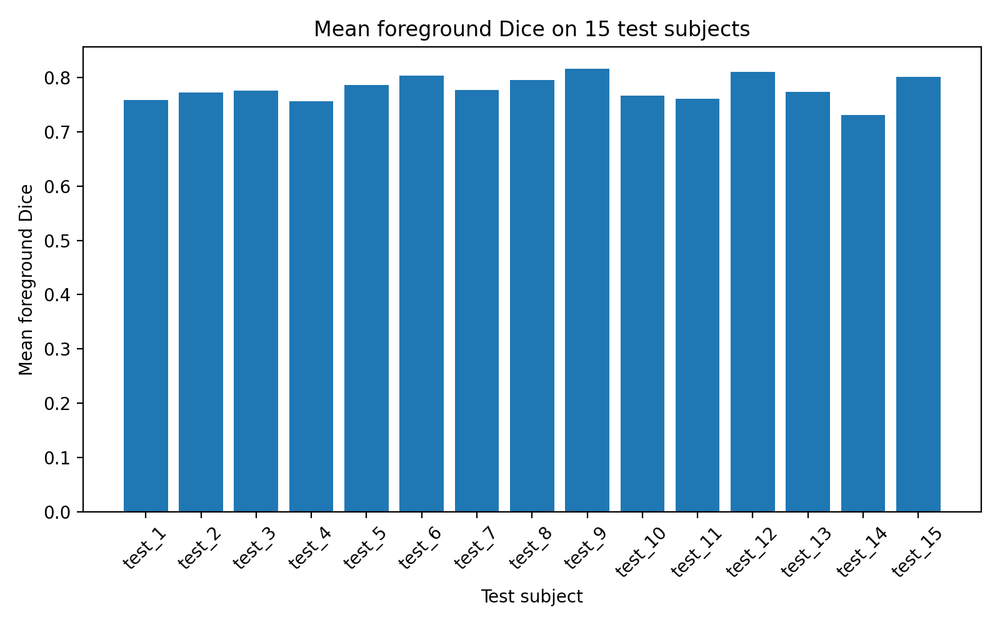
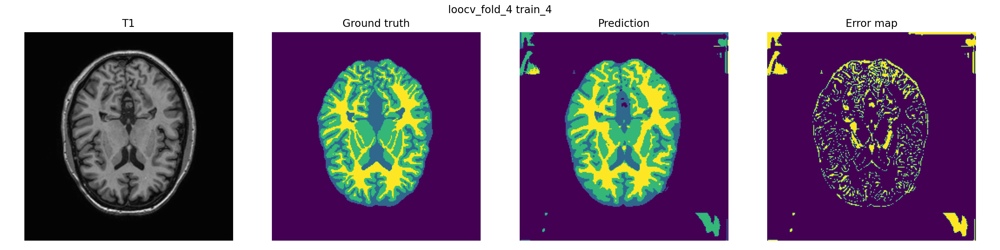

# 3D Brain MRI Segmentation

### Multi-modal volumetric tissue segmentation with a memory-efficient 3D U-Net

An end-to-end PyTorch pipeline for segmenting **CSF, gray matter and white matter** from multi-modal 3D brain MRI using the MRBrainS13 dataset.

The project combines three MRI modalities, foreground-biased patch sampling, volumetric augmentation and sliding-window inference to train a compact 3D U-Net under limited labelled data.

## Results

| Evaluation | Mean foreground Dice |
| --- | ---: |
| 5-fold leave-one-subject-out cross-validation | **0.723 ± 0.045** |
| Final model, 20 epochs | **0.779** |
| Final model, 40 epochs | **0.794** |

The final 40-epoch model was trained using all five labelled training subjects and evaluated on **15 additional subjects**, reaching:

| Tissue | Dice |
| --- | ---: |
| CSF | **0.797** |
| Gray matter | **0.779** |
| White matter | **0.806** |
| Mean foreground | **0.794** |



## Problem

3D medical image segmentation is challenging because MRI volumes are large, labelled subjects are limited and foreground tissue classes occupy much less space than background.

The pipeline was therefore designed around three constraints:

- preserve 3D spatial context;
- keep training memory requirements manageable;
- evaluate generalisation across subjects rather than relying on training performance.

## Input data

Each subject is represented by three aligned MRI modalities:

- **T1**;
- **T1-IR**;
- **T2-FLAIR**.

The three volumes are independently z-score normalised over non-zero voxels and stacked as input channels.

The target segmentation contains four classes:

- background;
- cerebrospinal fluid, including ventricles;
- gray matter, including basal ganglia;
- white matter, including lesions.

## Model and training pipeline

The model is a compact **3D U-Net** with a base channel width of 16.

Training uses **64 × 64 × 32** voxel patches rather than complete MRI volumes. Foreground-biased sampling increases the probability that patches contain tissue classes rather than mostly background.

The final training setup combines:

- Dice loss + Cross Entropy;
- foreground-biased patch sampling;
- random 3D flips;
- Gaussian noise;
- intensity scaling;
- intensity shifting.

Full MRI volumes are reconstructed during evaluation using overlapping **sliding-window inference**.

## Cross-validation

Only five labelled training subjects were available, so the main model-selection experiment used leave-one-subject-out cross-validation.

For each fold, four subjects were used for training and one was held out.

| Fold | Held-out subject | Mean foreground Dice |
| --- | --- | ---: |
| 1 | train_1 | 0.674 |
| 2 | train_2 | 0.709 |
| 3 | train_3 | 0.757 |
| 4 | train_4 | **0.782** |
| 5 | train_5 | 0.695 |



The cross-validation mean was **0.723**, with a sample standard deviation of **0.045**, showing noticeable subject-to-subject variation.

## Training ablation

A fold-1 comparison tested a simpler Dice-only, no-augmentation configuration against the final Dice + Cross Entropy and augmentation setup.

| Setup | Mean foreground Dice |
| --- | ---: |
| Dice only, no augmentation | **0.322** |
| Dice + Cross Entropy + augmentation | **0.587** |

The absolute improvement was **+0.265 Dice**.

Because loss and augmentation changed together, this comparison demonstrates the benefit of the **combined training setup** rather than isolating the contribution of either change individually.

## Final generalisation experiment

After cross-validation, the model was retrained using all five labelled training subjects and evaluated on fifteen additional subjects with available coarse labels.

Increasing training from 20 to 40 epochs improved mean foreground Dice from **0.779 to 0.794**.



## Qualitative evaluation

Segmentation predictions were also inspected visually using MRI slices, ground-truth labels, model predictions and error maps.

The main errors occur around tissue boundaries and smaller internal structures rather than complete failure to localise the brain.



## Repository structure

```text
3d-brain-mri-segmentation/
├── brain_mri_segmentation.ipynb
├── outputs/
│   ├── figures/
│   ├── results/
│   └── logs/
├── requirements.txt
└── README.md
```

The notebook contains the complete preprocessing, patch sampling, model training, cross-validation, sliding-window inference and evaluation pipeline.

Compact result tables and representative figures are retained under `outputs/` so the reported metrics can be inspected without rerunning model training.

## Installation

```bash
python -m venv .venv
source .venv/bin/activate
pip install -r requirements.txt
```

The MRBrainS13 MRI volumes are not distributed in this repository and must be obtained separately.

## Tech

**Python · PyTorch · 3D U-Net · NumPy · pandas · NiBabel · NIfTI · volumetric segmentation · medical imaging · sliding-window inference**
